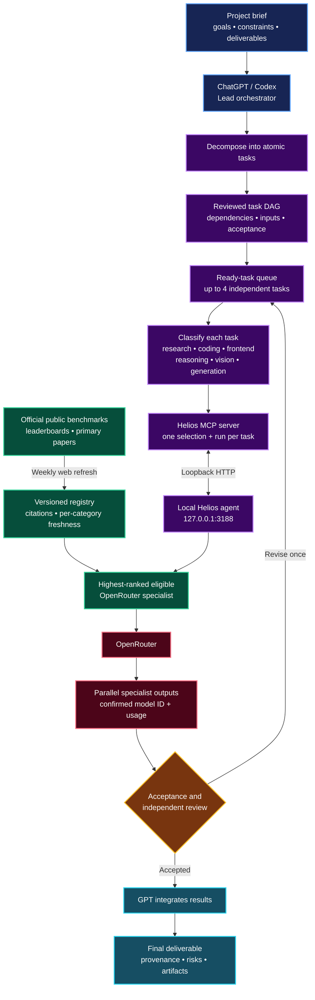

# Helios — Multi-LLM Orchestrator

> Turn ChatGPT or Codex into the lead orchestrator of a specialist AI team.

Helios is a local-first **multi-LLM orchestrator, MCP server, and OpenRouter gateway**. It lets ChatGPT, Codex, or another MCP client break a complex project into focused tasks, select an evidence-backed specialist for each task, review the results, and integrate the accepted work.

## Project goal

One model should not have to be the best at everything. Helios makes GPT the lead of a professional multi-model team:

- a research specialist can handle R&D;
- a coding specialist can handle backend engineering;
- a frontend specialist can implement the interface;
- vision, OCR, math, or generation specialists can handle their own task types;
- a different model family can independently review important outputs.

The examples are intentionally not hardcoded. Helios refreshes a cited public benchmark registry weekly and chooses the highest-ranked eligible model currently available through OpenRouter for each category.

## How a big project runs today

The workflow below is current behavior when the Helios skill is used by ChatGPT or Codex. Project state lives in the active host conversation.



### Orchestration sequence

1. GPT defines the objective, requirements, constraints, and observable acceptance criteria.
2. It decomposes the project into at most 12 atomic tasks and validates an acyclic dependency graph.
3. It classifies every model task and asks Helios for the matching benchmark-guided specialist.
4. It shows the reviewed execution plan before paid model calls.
5. After approval, it runs dependency-ready tasks in parallel batches of up to four.
6. Material outputs are checked against their acceptance criteria and, where practical, reviewed by a different model family.
7. GPT integrates only accepted outputs and reports model provenance, usage, unresolved risks, and blocked items.

Host-tool tasks—such as browsing, files, terminal commands, GitHub, or media generation—use the real tools available to ChatGPT/Codex. External models do not receive independent tool authority.

## Current capability boundary

Available now:

- ChatGPT/Codex-led project decomposition and session-scoped task graphs;
- per-task benchmark-guided specialist selection;
- parallel model execution, independent review, and final integration;
- Direct mode for one named model and Compare mode for two to four models;
- live OpenRouter model discovery;
- weekly, citation-backed public benchmark discovery with per-category freshness;
- loopback-only HTTP and MCP-over-stdio access;
- native startup automation and Monday 03:00 refresh on macOS and Windows.

Not yet durable:

- restart recovery and cross-conversation project state;
- a persistent dependency scheduler;
- pause/resume, enforced project budgets, durable artifact history, and event logs.

Those durable features are the scope of [Helios V2](docs/HELIOS_V2_TECHNICAL_SPEC.md). V2 does not replace today’s decomposition workflow; it moves that working host-orchestrated flow into a persistent local engine.

## Benchmark routing

Helios performs **web search only** for registry updates; it does not run private benchmark tests. Evidence must:

- come from an official leaderboard, benchmark site, or primary paper;
- provide one comparable ranking with at least three distinct models;
- include citation URLs returned by web search;
- avoid display-only tables, aggregators, estimates, and fabricated/composite scores.

If evidence is stale, insufficient, or the ranked models are unavailable on OpenRouter, Helios reports the limitation instead of claiming a strongest model.

## Installation

Requirements on both platforms: Python 3.10+, Node.js 22+, npm, Git, and an OpenRouter API key.

### macOS

```bash
git clone https://github.com/Erfouni/helios-llm-orchestrator.git
cd helios-llm-orchestrator
./scripts/install-macos.sh
```

The installer validates runtime versions, runs tests and security checks, stores the API key in macOS Keychain, installs both LaunchAgents, and attempts an initial stale-only benchmark refresh. The service uses legacy LaunchAgent and Keychain labels for upgrade compatibility.

### Windows 10/11

Open PowerShell as the Windows user who will run Helios:

```powershell
git clone https://github.com/Erfouni/helios-llm-orchestrator.git
Set-Location helios-llm-orchestrator
powershell -ExecutionPolicy Bypass -File .\scripts\install-windows.ps1
```

The Windows installer performs the same checks, encrypts the OpenRouter key with Windows DPAPI for the current user, creates an at-logon Scheduled Task for the local agent, creates the Monday 03:00 benchmark-refresh task, and attempts the initial refresh. See the [Windows guide](docs/WINDOWS.md) and [Windows MCP example](mcp/client-config.windows.example.json) for configuration, key rotation, task management, and uninstall steps.

Verify the local agent:

```bash
curl http://127.0.0.1:3188/health
```

Start the MCP server manually:

```bash
npm run mcp:start
```

Copy [mcp/client-config.example.json](mcp/client-config.example.json), replace the absolute project path, and add it to your MCP client configuration.

## MCP tools

| Tool | Purpose |
| --- | --- |
| `openrouter_list_models` | Search the live OpenRouter catalog |
| `openrouter_run_model` | Run one approved specialist task |
| `openrouter_compare_models` | Compare two to four models |
| `helios_get_benchmark_registry` | Inspect evidence and freshness |
| `helios_select_benchmark_model` | Select an eligible specialist by category |
| `helios_refresh_benchmarks` | Explicitly run a stale-only or full web refresh |

## HTTP API

- `GET /health`
- `GET /models?search=<query>&limit=<1-200>`
- `POST /run`
- `POST /compare`
- `POST /refresh-models`
- `GET /benchmarks/status`
- `GET /benchmarks?category=<category>`
- `GET /benchmarks/select?category=<category>`
- `POST /benchmarks/refresh`

There are intentionally no `/v2/projects` endpoints in the current server. See [API documentation](docs/API.md) and the [راهنمای فارسی](docs/USAGE_FA.md).

## Security

- The listener rejects non-loopback hosts.
- OpenRouter credentials come from macOS Keychain, a Windows DPAPI-encrypted user credential, or the process environment and are never returned.
- Optional `HELIOS_LOCAL_API_KEY` authentication can protect local HTTP calls when the MCP process is configured with the same value.
- Request bodies, messages, numeric parameters, paid concurrency, and model counts are bounded.
- HTTP errors do not expose unexpected internal exception details.
- External model output is treated as untrusted data.
- Routing never grants an external model authority to write files or publish content.

Run the complete verification suite:

```bash
npm ci
npm test
npm run scan:secrets
npm run audit:prod
```

See [Security Policy](SECURITY.md).

## License

MIT
