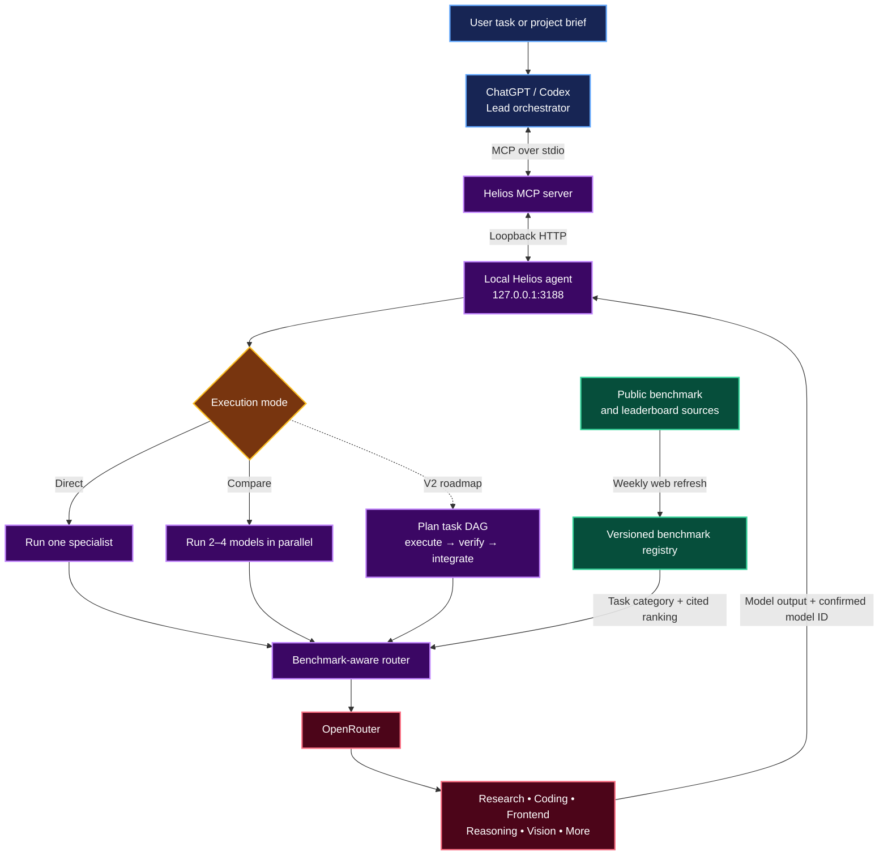

# Helios — Benchmark-Guided Multi-LLM Orchestrator

> Turn ChatGPT or Codex into the lead orchestrator of a specialist AI team.

Helios is a local-first **multi-LLM orchestrator, MCP server, and OpenRouter gateway**. It connects ChatGPT, Codex, and other MCP clients to multiple AI models, then helps route each task to the model best suited to it instead of forcing one model to do everything.

## The goal

The goal of Helios is to make GPT the lead of a professional, multi-model AI team.

A complex project contains different kinds of work: research, backend engineering, frontend implementation, reasoning, vision, review, and more. Helios gives the orchestrator one secure interface for delegating those jobs to specialized models through OpenRouter. A web-sourced benchmark registry is refreshed weekly so model selection can follow current public evidence rather than a permanently hardcoded list.

For example, a project might use:

| Work type | Illustrative specialist |
| --- | --- |
| Web research and R&D | A search-grounded model such as Perplexity |
| Backend engineering | A leading coding model from the Claude family |
| Frontend implementation | GLM 5.2 or the current frontend benchmark leader |
| Math and reasoning | The strongest available reasoning model |
| Independent review | A different high-performing model family |

These model names are examples, not fixed assignments. The registry can change the selected model as public leaderboards change and as models become available on OpenRouter.

## Architecture



The control path stays local: the MCP server communicates over stdio and the HTTP agent accepts loopback traffic only. A public domain is unnecessary unless a remote client must connect directly over the internet.

## How model selection works

1. The orchestrator identifies the kind of work, such as coding, frontend, mathematics, vision, or web research.
2. Helios queries its local benchmark registry for that category.
3. The registry returns the highest cited public-benchmark model currently available through OpenRouter.
4. Helios routes the request and records the exact model returned by OpenRouter.
5. When stronger validation is needed, the orchestrator can compare several models and keep each answer attributable to its source model.

The benchmark registry uses **public web evidence only**. Helios does not claim to run private benchmark tests. The macOS installer schedules a refresh every Monday at 03:00 local time and keeps versioned history.

## What works today

- Live OpenRouter model discovery.
- Direct execution by friendly alias or exact OpenRouter model ID.
- Parallel comparison of two to four models.
- Weekly, citation-backed public benchmark discovery.
- Benchmark-based model selection by task category.
- MCP tools for discovery, execution, comparison, registry lookup, and refresh.
- Loopback-only local service with credentials stored outside Git.
- macOS LaunchAgent installation for the service and weekly refresh.

## Helios V2 direction

The V2 goal is to extend the current router into a durable big-project orchestrator that can decompose a brief into a task graph, assign specialists, run independent work in parallel, verify outputs with a separate reviewer, preserve project state, and integrate accepted results.

That orchestration layer is documented as an implementation roadmap; it is not presented as a completed feature in the current release. See [Helios V2 Technical Specification](docs/HELIOS_V2_TECHNICAL_SPEC.md).

## Quick start on macOS

Requirements: macOS, Python 3.10+, Node.js 22+, npm, and an OpenRouter API key.

```bash
git clone https://github.com/Erfouni/helios-multimodel-router.git
cd helios-multimodel-router
./scripts/install-macos.sh
```

The installer asks for the OpenRouter key with hidden input and stores it in macOS Keychain. It does not write the key to this repository.

Verify the HTTP agent:

```bash
curl http://127.0.0.1:3188/health
```

Start the MCP server manually:

```bash
npm run mcp:start
```

For MCP client configuration, copy [mcp/client-config.example.json](mcp/client-config.example.json), replace the absolute project path, and add the entry to your MCP client.

## MCP tools

- `openrouter_list_models`
- `openrouter_run_model`
- `openrouter_compare_models`
- `helios_get_benchmark_registry`
- `helios_select_benchmark_model`
- `helios_refresh_benchmarks`

## HTTP API

- `GET /health`
- `GET /models?search=<query>&limit=<1-200>`
- `POST /run`
- `POST /compare`
- `POST /refresh-models`
- `GET /benchmarks/status`
- `GET /benchmarks?category=<category>`
- `GET /benchmarks/select?category=<category>`
- `POST /benchmarks/refresh`

See [API documentation](docs/API.md) for request examples and [راهنمای فارسی](docs/USAGE_FA.md) for the Persian guide.

## Security

- No credential is committed.
- `.env`, logs, build output, and dependencies are ignored.
- The default listener is loopback only; non-loopback configuration is rejected.
- OpenRouter credentials are fetched from macOS Keychain or a process environment variable.
- External model output is treated as untrusted input.
- Model routing never grants an external model direct authority to write files or publish content.

Run the checks before every commit:

```bash
npm ci
npm test
npm run scan:secrets
```

See [Security Policy](SECURITY.md).

## License

MIT
