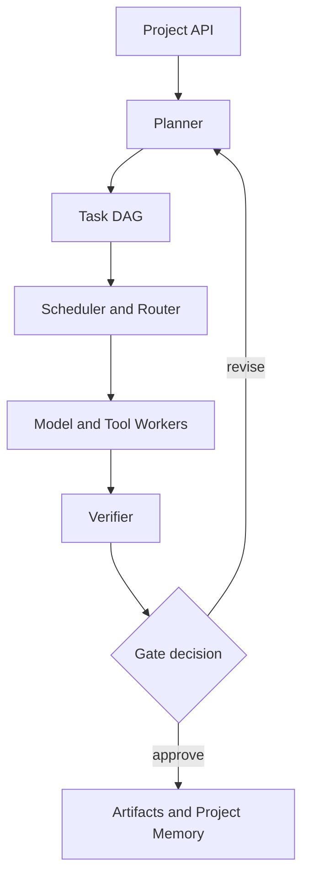

# Helios V2 Technical Specification

Status: Draft approved for implementation planning
Date: 2026-07-22
Target service: Mac OpenRouter Agent on `127.0.0.1:3188`

## 1. Executive decision

ChatGPT/Codex already orchestrates big projects with Helios in the active host session: it decomposes the brief, maintains the task DAG, selects a benchmark-guided specialist for each task, reviews outputs, and integrates accepted results.

Helios V2 will move that working host-orchestrated workflow into a durable local engine while preserving every current endpoint and its existing behavior.

The first release will be a local-first MVP using Python, SQLite, filesystem artifacts, and bounded background workers. PostgreSQL/object storage and a durable workflow engine are deferred until the orchestration contract is proven with a real industrial project.

The dark-factory horizontal glass buffer project will be the reference acceptance project.

## 2. Current-state audit

### Existing components

- Loopback-only Python HTTP gateway.
- OpenRouter model catalog discovery with a ten-minute in-memory cache.
- Friendly aliases and live model-name resolution.
- Single-model execution through `POST /run`.
- Parallel model comparison through `POST /compare`, limited to four models.
- MCP wrapper exposing model list, run, and compare tools.
- Basic request-size, prompt-size, output-token, and timeout limits.
- Weekly web-only public benchmark registry with citations, quality gates, per-category freshness, and OpenRouter availability matching.
- Benchmark lookup, selection, and refresh tools exposed through MCP.
- ChatGPT/Codex host orchestration with project decomposition, session-scoped task DAGs, parallel ready-task execution, independent review, and integration.
- Automated Python, JavaScript syntax, secret-scanning, and dependency-audit checks.
- API key loaded locally and not returned by endpoints.

### Confirmed operational status

- `GET /health` succeeds.
- Live model discovery succeeds.
- Four-model parallel execution succeeds.
- Kimi K3, Claude Sonnet 5, GLM 5.2, and DeepSeek V4 Pro were successfully exercised on the reference project.

### Gaps addressed by durable V2

- No persistent Project, Workstream, Task, Dependency, Gate, Artifact, Decision, or Risk entities in the local service.
- No persistent project state; process restart loses all orchestration state.
- No structured output contract or schema validation for model answers.
- No durable pause, resume, cancel, retry policy, idempotency, or checkpoint recovery.
- No project budget, token ceiling, per-task timeout, or cost roll-up.
- No versioned artifact registry.
- No persistent contradiction-resolution history or cross-session audit log.

## 3. Goals and non-goals

### V2 MVP goals

1. Accept a large project brief and create a reviewable project plan.
2. Decompose it into workstreams and atomic tasks with explicit dependencies.
3. Validate that the dependency graph is acyclic.
4. Route ready tasks to suitable models or tools.
5. Run independent tasks concurrently within budget and concurrency limits.
6. Validate outputs against task-specific acceptance criteria.
7. Block sensitive or high-risk tasks at human approval gates.
8. Persist every state transition, decision, usage record, and artifact reference.
9. Resume safely after service restart.
10. Preserve V1 API compatibility.

### Non-goals for the MVP

- Autonomous certification of structural, electrical, functional-safety, medical, legal, or financial work.
- Treating an LLM response as a substitute for CAD, FEA, PLC simulation, or physical validation.
- Public internet exposure of the local gateway.
- A full enterprise UI, multi-tenant permissions, or distributed execution.
- Automatic write access to user files or social accounts without explicit approval.

## 4. System architecture

### Required modules

- `api`: V1 compatibility routes and V2 project routes.
- `domain`: typed project, task, dependency, gate, artifact, risk, and decision models.
- `store`: SQLite repositories and transactional state transitions.
- `planner`: brief-to-DAG decomposition and replanning.
- `scheduler`: readiness detection, concurrency control, cancellation, and retry.
- `router`: capability-based model/tool selection.
- `workers`: OpenRouter, web research, code, file, CAD/simulation adapters.
- `verifier`: schema checks, critic review, tool validation, and acceptance scoring.
- `artifacts`: versioned file metadata, checksums, provenance, and links.
- `policy`: budgets, approval gates, data boundaries, and safety rules.
- `telemetry`: structured logs, usage, latency, cost, and project summaries.

## 5. Domain model

### Project

Required fields:

- `id`, `name`, `objective`, `scope`, `constraints`
- `status`: `draft | planning | awaiting_plan_approval | running | paused | blocked | completed | failed | cancelled`
- `budget_usd`, `token_budget`, `deadline`, `max_concurrency`
- `created_at`, `updated_at`, `version`
- `source_brief`, `assumptions`, `success_criteria`

### Task

Required fields:

- `id`, `project_id`, `workstream`, `title`, `description`
- `status`: `draft | blocked | ready | running | verifying | awaiting_approval | succeeded | revision_required | failed | cancelled`
- `dependencies`, `inputs`, `expected_outputs`
- `acceptance_criteria`, `risk_level`, `requires_human_approval`
- `capabilities_required`, `preferred_models`, `preferred_tools`
- `attempt_count`, `max_attempts`, `timeout_seconds`
- `estimated_cost_usd`, `actual_cost_usd`, `token_usage`
- `assigned_worker`, `model_used`, `started_at`, `finished_at`

### Supporting entities

- `Dependency`: upstream task, downstream task, dependency type.
- `Artifact`: path/reference, MIME type, checksum, version, producer task, provenance.
- `Gate`: gate type, owner, evidence required, decision, rationale, timestamp.
- `Risk`: likelihood, impact, mitigation, owner, state.
- `Decision`: alternatives, selected option, rationale, evidence, reversibility.
- `Execution`: request fingerprint, model/tool, attempt, latency, usage, cost, result state.
- `Event`: append-only audit record for every state transition.

## 6. Orchestration lifecycle

1. **Intake**: validate the project brief and budgets.
2. **Plan**: planner returns a schema-conforming work breakdown and task DAG.
3. **Plan verification**: check cycles, missing inputs, untestable acceptance criteria, unsupported capabilities, and unjustified assumptions.
4. **Human plan gate**: user approves or requests revision before costly execution.
5. **Schedule**: mark dependency-satisfied tasks ready.
6. **Route**: rank candidate models/tools and record the selection rationale.
7. **Execute**: run with bounded concurrency, timeout, retry, and budget checks.
8. **Verify**: validate structure, evidence, calculations, and acceptance criteria.
9. **Replan**: create explicit revision tasks when verification fails; never silently overwrite history.
10. **Approve**: require human authorization for sensitive writes or engineering release gates.
11. **Synthesize**: assemble accepted artifacts and an answer-first project report.
12. **Close**: confirm success criteria, unresolved risks, cost, and provenance.

## 7. Model and tool routing

### Capability registry

Each model/tool record must contain:

- Supported capabilities and modalities.
- Context and output limits.
- Supported reasoning/tool/structured-output parameters.
- Input, output, search, and image pricing.
- Measured latency and success rate.
- Cited public benchmark evidence by task category, including source URL, registry hash, and per-category freshness.
- Optional locally measured operational telemetry, clearly labeled and never presented as a public benchmark.
- Reliability flags and known failure patterns.
- Last validation date.

### Routing score

The MVP uses a transparent weighted score:

`score = quality_fit + capability_fit + reliability - cost_penalty - latency_penalty - risk_penalty`

Routing rules:

- Hard capability constraints are applied before ranking.
- High-risk outputs require a separate verifier model or deterministic tool.
- The producer and verifier should use different model families when practical.
- A model cannot validate its own output as the only verifier.
- Latest model age alone must never determine selection.
- Selection rationale is stored with every execution.

## 8. Verification policy

Verification is layered:

1. JSON/schema validation.
2. Required-section and acceptance-criteria coverage.
3. Source/provenance checks for factual research.
4. Deterministic tool checks for code, calculations, files, and simulations.
5. Independent critic model for ambiguity, contradiction, and unsupported assumptions.
6. Human approval for release-critical work.

The verifier returns:

- `pass | revision_required | blocked | human_review_required`
- criterion-by-criterion evidence
- unsupported claims
- missing inputs
- recommended next action

Fabricated numbers or unlabeled assumptions automatically trigger `revision_required`.

## 9. API contract

### Preserve V1

- `GET /health`
- `GET /models`
- `POST /run`
- `POST /compare`
- `POST /refresh-models`

### Add V2

- `POST /v2/projects`
- `GET /v2/projects/{project_id}`
- `POST /v2/projects/{project_id}/plan`
- `GET /v2/projects/{project_id}/tasks`
- `POST /v2/projects/{project_id}/start`
- `POST /v2/projects/{project_id}/pause`
- `POST /v2/projects/{project_id}/resume`
- `POST /v2/projects/{project_id}/cancel`
- `GET /v2/tasks/{task_id}`
- `POST /v2/tasks/{task_id}/run`
- `POST /v2/tasks/{task_id}/verify`
- `POST /v2/tasks/{task_id}/approve`
- `POST /v2/tasks/{task_id}/request-revision`
- `GET /v2/projects/{project_id}/artifacts`
- `GET /v2/projects/{project_id}/events`
- `GET /v2/projects/{project_id}/usage`

### API requirements

- JSON only for the MVP.
- UUID identifiers.
- UTC timestamps in ISO 8601.
- Idempotency key for create, start, run, approve, and cancel operations.
- Optimistic version check for state-changing requests.
- Consistent error object with code, message, retryability, and safe details.
- No secret, hidden prompt, or unrelated private context in responses or logs.

## 10. Persistence and recovery

### MVP

- SQLite in WAL mode.
- Transactional task state transitions.
- Append-only event table.
- Filesystem artifact directory with content checksum.
- Startup recovery changes orphaned `running` tasks to `ready` or `blocked` according to retry policy.
- Request fingerprints prevent duplicate paid model calls after ambiguous retries.

### Production evolution

- PostgreSQL for project state.
- Object storage for artifacts.
- Temporal for durable workflows, timers, cancellation, and recovery.
- Optional vector index only for retrieval; it must not replace authoritative project records.

## 11. Security boundaries

- Continue binding to `127.0.0.1` by default.
- Never expose or return API keys.
- Never read secrets from clipboard, logs, unrelated files, or external prompts.
- Store only user-visible, task-relevant context in model requests.
- Redact credentials and sensitive identifiers before persistence.
- Treat model output as untrusted input.
- Enforce path allowlists for artifact operations.
- External models propose mutations; the trusted orchestrator and approval policy authorize them.
- Public/tunnel access is blocked until authentication, TLS, rate limiting, and authorization are implemented.

## 12. Budgets and controls

Budget enforcement occurs before every paid execution:

- Project dollar and token ceilings.
- Per-task cost and token ceilings.
- Maximum concurrent calls.
- Model allow/deny lists.
- Deadline and timeout.
- Maximum retry count.
- Automatic pause at 80% of project budget unless explicitly overridden.
- Hard stop at 100%.

## 13. Observability

Capture without storing hidden reasoning:

- Project/task status and duration.
- Model requested, resolved, and actually used.
- Token usage and cost.
- Retry and failure category.
- Verification result and failed criteria.
- Queue time and execution latency.
- Artifact versions and checksums.
- State transitions and approval decisions.

## 14. Test strategy

### Unit tests

- Model resolution and capability filtering.
- Project/task state transitions.
- DAG cycle detection and readiness calculation.
- Budget enforcement.
- Retry classification and idempotency.
- Schema validation and safe error serialization.

### Integration tests

- V1 compatibility.
- Create, plan, approve, start, pause, restart, and resume a project.
- Independent parallel tasks execute concurrently.
- Failed verification creates a revision path.
- Restart during a paid request does not duplicate execution silently.
- Cost and token totals equal recorded executions.

### Reference acceptance test

Use the horizontal multi-tier glass buffer project. The MVP passes only if it:

1. Produces separate requirements, process, mechanical, structural, controls, safety, scheduling, simulation, procurement, and commissioning workstreams.
2. Detects missing glass thickness, takt-time, buffer-duration, layout, utility, and interface data.
3. Refuses to invent engineering calculations.
4. Builds an acyclic dependency graph.
5. Assigns different specialties and routes at least two independent tasks concurrently.
6. Sends a fabricated numeric assumption to revision.
7. Pauses at plan and engineering-release approval gates.
8. Survives a service restart and resumes without losing history.
9. Reports total cost, tokens, models used, risks, and artifacts.

## 15. Implementation plan

### Milestone 0 — Repository and safety baseline (one day)

- Initialize Git in the active runtime directory or move the code into the intended Helios repository.
- Add `.gitignore` covering `.env`, logs, databases, caches, and artifacts containing private data.
- Add a Python virtual environment definition and lock dependencies.
- Add automated V1 smoke tests before refactoring.
- Tag the preserved working version as the V1 baseline.

### Milestone 1 — Domain and persistence (two to three days)

- Split the single file into modules while preserving V1 routes.
- Implement typed schemas, SQLite migrations, repositories, events, and state transitions.
- Implement DAG validation and task readiness.

### Milestone 2 — Planning and routing (two to three days)

- Implement structured project planning.
- Add capability registry and transparent routing score.
- Add plan verification and human plan approval.

### Milestone 3 — Execution and verification (three to four days)

- Implement scheduler, bounded parallel workers, retries, cancellation, and budgets.
- Add verifier contract, independent critic, and revision tasks.
- Add artifact registry and project usage roll-up.

### Milestone 4 — Acceptance and MCP exposure (two days)

- Add V2 MCP tools.
- Run restart/recovery and cost-accounting tests.
- Execute the reference glass-buffer project.
- Publish the acceptance report and known limitations.

## 16. Immediate backlog in execution order

1. Protect secrets and establish the V1 Git baseline.
2. Add a V1 API smoke-test suite.
3. Create the Python package/module layout.
4. Define project/task schemas and SQLite migration 001.
5. Implement project CRUD and event audit.
6. Implement DAG validation and plan endpoint.
7. Implement approval gates.
8. Implement scheduler and task execution records.
9. Implement capability registry and router.
10. Implement verification and revision loop.
11. Add artifacts, usage, and recovery.
12. Extend MCP tools and run the reference acceptance test.

## 17. Definition of done for Helios V2 MVP

Helios V2 MVP is complete when a user can submit a large project, inspect and approve its plan, execute dependency-safe work in parallel, receive independently verified outputs, stop and resume after a restart, and inspect a complete history of cost, model use, decisions, risks, gates, and artifacts—without breaking the existing `/run` and `/compare` workflows.
